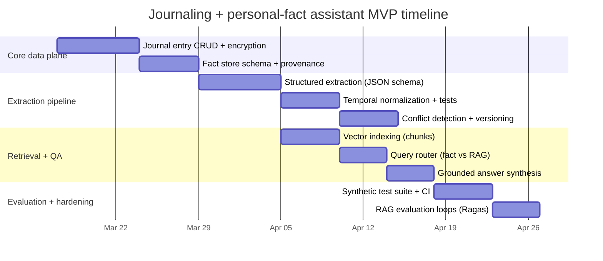

# Building a journaling app and personal assistant with open-source LLM memory

## Executive summary

A journaling app that can reliably answer personal-fact questions (“When is my birthday?”) must treat **memory as a first-class, structured subsystem**, not as an emergent property of a chat model. Retrieval-Augmented Generation (RAG) is useful for *contextual recall* over past notes, but **canonical personal facts should live in an explicit fact store with provenance and temporal semantics**, then be verbalized by the LLM under strict grounding constraints (answer only from retrieved facts; otherwise say “I don’t know yet”). This reduces hallucinations and enables auditing, correction, and compliance workflows. citeturn0search10turn0search15turn0search5

A rigorous design typically uses **two complementary memory representations**:

1. **Immutable journal entries** (source of truth of what the user wrote, when they wrote it, and under what timezone), stored in a durable datastore and indexed for semantic + keyword retrieval (vector DB + optional BM25 or full-text). citeturn12search0turn12search1turn14search3  
2. **Derived fact assertions** (typed, normalized, versioned, and time-scoped), stored in a relational/metadata store with provenance pointers back to the entries (span offsets, extraction model version, confidence, and conflict status). The assistant should answer fact queries from this store and cite provenance internally (and optionally in the UX). citeturn11search3turn7search0

Pragmatically, “open-source LLM” choices split into **open weights under custom terms** (e.g., Llama, Gemma) vs **permissively licensed weights** (e.g., Apache 2.0 or MIT). This matters for redistribution, commercial use, and downstream training/distillation. citeturn17search4turn17search0turn16search0turn5search7turn5search5

Recommended reference stacks:

- **Fully local/offline (desktop-class device)**: small open model + local inference runtime + encrypted embedded datastore + embedded vector store. Use `llama.cpp` (GGUF) or MLX on Apple Silicon, encrypt journal/fact DB with SQLCipher, and store embeddings in LanceDB or Chroma local. citeturn3search1turn3search6turn8search4turn15search36turn4search6  
- **Self-hosted server**: vLLM OpenAI-compatible serving + Qdrant/Milvus + Postgres metadata store (optionally with pgvector for hybrid relational/vector needs). citeturn7search0turn12search1turn13search2turn13search3  
- **Cloud-hosted with privacy controls**: deploy the same open components in a private VPC/Kubernetes with encryption, access control, and data retention policies aligned with GDPR/CCPA rights (access/erasure/correction). citeturn8search5turn8search2turn8search3

## Reference architecture and end-to-end flows

A robust system separates “writing” from “remembering” and “answering.” The LLM is used for **structured extraction** and **response synthesis**; it should not be the only place facts live.

```mermaid
flowchart TD
  A[Client: mobile/web/desktop\nJournal editor + chat UI] -->|entry text + entry_timestamp + tz| B[Ingestion API]
  B --> C[Immutable Journal Store\n(SQLite/Postgres + attachments)]
  B --> D[Extraction Pipeline]
  D --> E[Fact Store\n(Relational / KV + versioning)]
  D --> F[Embedding + Chunking]
  F --> G[Vector Index\n(Qdrant/Milvus/Weaviate/pgvector/etc)]
  A -->|question| H[Query Router]
  H -->|fact query| I[Fact Lookup\n(symbolic/SQL)]
  H -->|open-ended| J[RAG Retrieval\n(vector + optional BM25)]
  I --> K[Grounded Answer Synthesis\nLLM w/ strict rules]
  J --> K
  K --> A
```

Key architectural choices and why they matter:

- **Vector index + metadata filtering**: semantic similarity alone is rarely enough; you frequently need filters such as date ranges, entry types, or “only user-authored entries.” Vector DBs like Weaviate, Qdrant, and Milvus explicitly support metadata/payload filtering and hybrid search patterns. citeturn12search0turn12search1turn12search2turn12search6  
- **OpenAI-compatible serving layer**: for open-source models, using an OpenAI-compatible interface simplifies client code and lets you swap runtimes (vLLM server, llama-cpp-python server) without rewriting the app’s LLM client. citeturn7search4turn7search9  
- **Structured outputs enforcement**: extraction must be machine-parseable and schema-valid. Constrained decoding / structured generation libraries (Outlines, Guidance, Jsonformer) and JSON Schema validation (Pydantic) are the practical backbone for getting reliable structured memory. citeturn11search10turn11search1turn11search2turn11search3  

## Data model for journal entries and extracted facts

A journaling assistant needs a **bitemporal-ish** viewpoint: (1) when the user wrote something, (2) what real-world time the statement refers to, and (3) whether the fact is recurring (birthdays) or time-bounded (“I live in Boston *this month*”).

A minimal but robust schema separates:

- **Journal entries** (immutable source record)
- **Chunks** (retrieval units for RAG)
- **Facts** (current canonical state) and **fact assertions** (history & provenance)

Below is a reference schema (Postgres-flavored SQL; SQLite works similarly). The goal is clarity, provenance, and conflict handling—not maximal normalization.

```sql
-- 1) Immutable journal entries (source of truth)
CREATE TABLE journal_entries (
  entry_id            UUID PRIMARY KEY,
  user_id             UUID NOT NULL,
  created_at_utc      TIMESTAMPTZ NOT NULL,
  entry_local_date    DATE NOT NULL,          -- for "today" normalization
  entry_timezone      TEXT NOT NULL,          -- e.g., "America/New_York"
  source              TEXT NOT NULL,          -- web|ios|android|desktop
  raw_text            TEXT NOT NULL,
  content_hash        TEXT NOT NULL,
  deleted_at_utc      TIMESTAMPTZ NULL
);

-- 2) Retrieval chunks (what you embed + store in vector DB)
CREATE TABLE journal_chunks (
  chunk_id            UUID PRIMARY KEY,
  entry_id            UUID NOT NULL REFERENCES journal_entries(entry_id),
  chunk_index         INT NOT NULL,
  chunk_text          TEXT NOT NULL,
  char_start          INT NOT NULL,
  char_end            INT NOT NULL,
  embedding_model     TEXT NOT NULL,
  embedding_dim       INT NOT NULL,
  created_at_utc      TIMESTAMPTZ NOT NULL
);

-- 3) Fact definitions (typed "slots" your assistant cares about)
CREATE TABLE fact_types (
  fact_type           TEXT PRIMARY KEY,       -- e.g., "birthday"
  value_kind          TEXT NOT NULL,          -- date|string|number|json
  is_recurring        BOOLEAN NOT NULL DEFAULT FALSE
);

-- 4) Fact assertions (append-only history with provenance)
CREATE TABLE fact_assertions (
  assertion_id        UUID PRIMARY KEY,
  user_id             UUID NOT NULL,
  fact_type           TEXT NOT NULL REFERENCES fact_types(fact_type),
  value_json          JSONB NOT NULL,         -- normalized value payload
  normalized_key      TEXT NOT NULL,          -- e.g., "birthday"
  valid_from          DATE NULL,              -- optional real-world validity
  valid_to            DATE NULL,
  confidence          REAL NOT NULL,          -- 0..1
  status              TEXT NOT NULL,          -- active|superseded|conflict|retracted
  supersedes_id       UUID NULL REFERENCES fact_assertions(assertion_id),

  source_entry_id     UUID NOT NULL REFERENCES journal_entries(entry_id),
  source_char_start   INT NOT NULL,
  source_char_end     INT NOT NULL,

  extractor_name      TEXT NOT NULL,          -- pipeline versioning
  extractor_version   TEXT NOT NULL,
  extracted_at_utc    TIMESTAMPTZ NOT NULL
);

-- 5) Convenient "current facts" view (latest non-conflict assertion per fact_type)
CREATE VIEW current_facts AS
SELECT DISTINCT ON (user_id, fact_type)
  *
FROM fact_assertions
WHERE status = 'active'
ORDER BY user_id, fact_type, extracted_at_utc DESC;
```

Design notes:

- **Provenance is non-negotiable**: you need `source_entry_id` + character offsets so you can (a) show the user *why* the assistant believes something and (b) support correction workflows. This is also crucial for “right of access” and user trust. citeturn8search9turn8search5  
- **Versioning and conflict states**: do not overwrite facts in place. Store new assertions, mark old ones `superseded`, and mark contradictions as `conflict` until resolved. This supports auditability and reduces silent wrong answers. citeturn7search11turn7search15  
- **Deletion semantics**: to support GDPR erasure, your system must delete (or cryptographically shred) both journal entries and derived fact assertions (and ensure embeddings/vector points are removed too). citeturn8search25turn8search5  

## Extraction and NLP pipeline for durable personal facts

The core challenge is turning free text into **normalized, time-aware, entity-resolved** facts while minimizing over-extraction (false positives) and contradictions.

```mermaid
flowchart LR
  A[Entry text + entry date/tz] --> B[Preprocessing\nnormalize whitespace, language]
  B --> C[Candidate detection\nis this a factual assertion?]
  C --> D[Entity & coref\nresolve "she/he/they" within entry]
  D --> E[Temporal parsing\nresolve 'today', 'next Friday']
  E --> F[LLM structured extraction\nJSON schema output]
  F --> G[Validation\nPydantic + rules]
  G --> H[Conflict detection\ncompare to current_facts]
  H --> I[Persist assertion\nactive|conflict|superseded]
```

Concrete, recommended components:

- **Named Entity Recognition (NER)**: spaCy’s NER component identifies labeled spans and can be integrated as a pipeline step; Stanza also provides multilingual NER modules. citeturn10search0turn10search2turn10search4  
- **Coreference resolution (within-entry)**: `coreferee` is a spaCy-compatible plugin; Stanza includes a coreference model; AllenNLP provides classic end-to-end coreference implementations (often slower). citeturn10search5turn10search14turn10search3  
- **Temporal normalization** (critical for “Today is my birthday”): rule-based temporal taggers like Duckling parse natural language time expressions; HeidelTime is a widely referenced temporal tagger family (rule-based, domain-adapted). citeturn2search27turn2search19turn2search37  
  - Temporal annotation standards such as **TimeML/TIMEX3** and resources like **TimeBank** exist for evaluation and for thinking clearly about anchoring underspecified expressions to a document creation time. citeturn18search0turn18search28turn18search1  
- **LLM structured extraction**: use the LLM for the hard semantic step (what fact is being asserted?) but force it to output schema-valid JSON.
  - Schema enforcement: Outlines and Guidance provide constrained decoding / structured outputs; Jsonformer is another approach that “fills” fixed JSON tokens and generates only content tokens. citeturn11search10turn11search1turn11search2  
  - Validation: Pydantic’s JSON Schema support is a practical standard for defining and validating the expected structure. citeturn11search3  
  - If serving open models via vLLM, the project explicitly supports an OpenAI-compatible server and discusses structured/tool-style APIs; this can simplify structured extraction endpoints. citeturn7search4turn7search8  

A worked example (your birthday scenario):

- Entry metadata: `entry_local_date = 2026-01-29`, timezone = America/New_York  
- Text: “Today is my birthday.”  
- Temporal normalization resolves “today” to `2026-01-29`. The assistant should store **recurring birthday** as month/day (Jan 29) rather than treating 2026 as the birth year (unless the user explicitly says “I was born in 2026,” etc.). Time standards like TIMEX3 explicitly support anchoring and value normalization concepts (ISO 8601 values, anchors). citeturn18search28turn18search0  

## Memory management, indexing, retrieval, and grounding

### Memory tiers and lifecycle

A practical system uses three memory tiers:

- **Working memory**: short conversational context (current session), not persisted or persisted only with explicit user consent.  
- **Short-term memory**: recent entries and extracted transient facts, optionally decayed with time. LangChain explicitly discusses retrieval patterns such as “time-weighted” retrieval for recency-sensitive results. citeturn3search33  
- **Long-term memory**: durable, user-confirmed facts (birthday, allergies, family members). This is what should answer “When is my birthday?” and should not silently change without provenance or user action.

### TTL, conflicts, and versioning

A journaling assistant will frequently see contradictory statements (“I’m vegetarian” → later “I eat chicken now”). This is expected.

Recommended policy:

- **Store new assertions; do not delete old ones** (unless user requests deletion). Mark old values `superseded`, and keep provenance.  
- **Conflict detection** triggers when a new assertion targets the same `fact_type` but has a different normalized value. Put it in `conflict` and either (a) ask a clarification question or (b) prefer the newer one only if confidence and textual cues strongly indicate a correction (“Actually,” “Correction,” “I was wrong earlier”).  
- **User-confirmation loop** for high-impact facts (medical, legal, identity). This is a UX + safety choice more than an ML one.

### Vector vs symbolic retrieval

For personal-fact queries, **symbolic lookup should be first-class**, because:

- It is deterministic, inspectable, and fast.
- It reduces hallucination by removing the need to “infer” facts from semantically similar text.

Vector retrieval still matters for:

- Open-ended questions (“How have I been feeling about work lately?”)
- Evidence gathering (“Show what I wrote around my last birthday”)
- Disambiguation (“Which ‘Sarah’ do I mean?”)

Approximate nearest-neighbor (ANN) indices commonly use graph-based structures like HNSW (hierarchical navigable small worlds) for efficient similarity search, and libraries like Faiss provide widely used indexing/search primitives. citeturn2search24turn3search33turn2search25turn2search33  

### Embeddings and chunking strategy

Embedding choice materially affects retrieval quality:

- Sentence-BERT introduced efficient sentence embeddings suitable for similarity search. citeturn9search0  
- E5 embeddings are trained via weakly-supervised contrastive pretraining and are designed to transfer across retrieval tasks. citeturn9search1turn9search25  
- BGE embeddings and BGE-M3 target strong retrieval and multilingual capabilities; BGE-M3 is described as multi-lingual/multi-functionality/multi-granularity. citeturn9search3turn9search11  

Chunking is an accuracy lever, not busywork:

- LangChain’s recursive text splitting documents `chunk_size` and `chunk_overlap` and explicitly motivates overlap as a mitigation for context loss across chunk boundaries. citeturn14search0turn14search4  
- Haystack’s DocumentSplitter exists specifically to fit model limits and speed question answering by splitting long texts. citeturn14search2  
- LlamaIndex also provides node parsers (including hierarchical parsing) to create multi-granularity chunk structures. citeturn14search5turn4search26  

Practical heuristics (to be tuned empirically):

- Use **smaller chunks** (e.g., 200–500 tokens) for high-recall semantic retrieval, and optionally keep parent pointers for reconstructing broader context (“parent document retriever” pattern).  
- Use metadata filters to constrain by date windows, entry types, or “user_id” to prevent cross-user leakage. Qdrant, Milvus, and Weaviate all highlight filtering/hybrid retrieval patterns. citeturn12search1turn12search2turn12search0  

### Prompt templates for extraction and grounded answering

Below are practical templates. They are written to be model-agnostic, but work best when combined with **schema-enforced JSON output** (Outlines/Guidance/Pydantic). citeturn11search10turn11search3  

**System prompt for fact extraction**
```text
You are an information extraction component for a private journaling app.
Your job: extract ONLY facts explicitly stated or unambiguously implied by the user.
Do NOT guess. Do NOT add extra facts.

Return a single JSON object that matches the provided schema.
If no facts are present, return {"facts": []}.

Use the provided entry_local_date and entry_timezone as the reference time
to interpret relative dates like "today", "yesterday", "next Friday".

For each fact, include:
- fact_type
- normalized_value
- confidence (0..1)
- evidence_span (start_char, end_char)
```

**System prompt for grounded personal-fact Q&A**
```text
You are a personal assistant answering questions about the user's life.
You will be given:
(1) a list of CURRENT_FACTS from the fact store (structured, authoritative),
(2) optional EVIDENCE_SNIPPETS from journal entries.

Rules:
- If CURRENT_FACTS contains the answer, answer using ONLY those facts.
- If the answer is not present, say you don't know yet and ask a clarifying question.
- Never invent dates, names, or events.
- When answering, prefer the most recent ACTIVE assertion.
```

**Retrieval context template**
```text
CURRENT_FACTS:
{{facts_json}}

EVIDENCE_SNIPPETS (may be empty):
{{snippets_with_dates}}

USER QUESTION:
{{question}}
```

## Open-source LLM and vector database options

### Open-weight LLM options

The table focuses on models that are commonly used in local/self-hosted deployments and have clearly documented licensing terms. Note that “open” often means **open weights with terms**, not necessarily OSI-approved open source. citeturn16search22turn17search4turn17search13  

| Model (family) | License / terms | Typical sizes and context | Strengths for journaling assistant | On-device feasibility (typical) | Notes / caveats |
|---|---|---|---|---|---|
| Llama 3.1 | Custom “Llama 3.1 Community License” | 8B / 70B / 405B; prompt formats documented | Strong general assistant behavior; widely supported toolchain | 8B feasible on desktop with quantization; larger sizes usually server/GPU | The license is custom (not a standard FOSS license); FSF explicitly argues it is not a free software license. citeturn17search4turn17search0turn17search13 |
| Llama 3.2 | Custom “Llama 3.2 Community License” | Small models (e.g., 1B/3B) and vision variants listed | Good for on-device or low-latency self-host; useful for extraction + routing | Feasible on-device for small sizes | Same “custom license” structure; verify acceptability for your distribution. citeturn6search2turn6search30 |
| Qwen 2.5 | Mostly Apache 2.0 (check per-model exceptions) | 0.5B–72B; long-context support described | Strong instruction following; long context variants can help multi-entry reasoning | Smaller models feasible locally; large models server/GPU | Official materials describe 128K support and multiple sizes; confirm license per checkpoint. citeturn6search11turn6search3 |
| Mistral 7B | Apache 2.0 | ~7B; instruct variants | Efficient baseline for extraction and Q&A; broad compatibility | Feasible on consumer GPUs and some CPUs with quantization | Released under Apache 2.0 “without restrictions” per Mistral announcement. citeturn6search13turn6search1 |
| Mistral NeMo 12B | (Open-weight; used widely; confirm terms per release) | 12B; up to 128k context | Larger context useful for long entries & retrieval synthesis | Typically server/GPU; may run locally on high-end Macs/GPUs | Mistral announces 128k context and collaboration with NVIDIA. citeturn6search4turn6search0 |
| Gemma 2 | Gemma Terms of Use + prohibited use policy | 2B / 9B / 27B | Strong smaller “open model” option; good for local factual mode | 2B/9B plausible on-device/desktop | License includes distribution conditions and use restrictions; treat as open-weight under terms, not OSI open source. citeturn16search0turn16search19turn5search0 |
| Phi-3 (and Phi-3.5) | MIT License (weights repo license indicates MIT) | ~3.8B mini; long-context variants exist | Strong small-model reasoning relative to size; good for on-device extraction | Strong candidate for local/offline | Hugging Face model cards describe parameter size and training summary; license file indicates MIT. citeturn5search1turn5search7turn5search13 |
| DeepSeek-R1 | MIT License (per model card and release notes) | Distilled variants + large reasoning models | Strong reasoning-oriented family; good for structured extraction and conflict analysis | Smaller distilled variants feasible; very large models server-class | Release notes and model card explicitly state MIT licensing and allow commercial use. citeturn5search26turn5search5 |

### Vector DB / retrieval backends (Pinecone alternatives included)

| System | License | Deployment model | Filtering / hybrid search | On-device feasibility | Notes |
|---|---|---|---|---|---|
| Qdrant | Open source; vector “points” with payload | Server (Docker/K8s) + “local mode” in client | Payload filtering documented | Local mode possible for prototyping; mobile less common | Qdrant defines points as vector + payload; filtering is a first-class concept. citeturn7search33turn12search1turn7search6 |
| Milvus | Apache 2.0 | Standalone Docker or distributed | Metadata filtering + scalar filters | Typically server-class | Standalone deployment has explicit prerequisites; filtering docs show predicate expressions. citeturn13search2turn12search2turn13search27 |
| Weaviate | BSD-3-Clause (repo indicates) | Cloud-native server | Hybrid search (BM25 + vector) documented | Typically server | Official docs describe hybrid search combining BM25F + vector search with configurable fusion. citeturn13search4turn12search0turn12search4 |
| Chroma | Apache 2.0 | Embedded/local and server modes | Metadata + vector retrieval patterns | Strong for local/dev; Android library exists (beta) | Apache 2.0 license in repo; Android library indicates on-device direction. citeturn4search6turn4search18turn4search2 |
| LanceDB | Apache 2.0 | Embedded “SQLite-like” vector DB; can scale via object storage | Hybrid search + versioning features discussed | Good for local/embedded | FAQ confirms OSS Apache 2.0; LangChain docs describe it as embedded and persisted to disk. citeturn15search36turn4search15turn4search7 |
| pgvector | PostgreSQL license (repo license text) | Postgres extension | SQL filtering + joins + vector operators | Server/desktop (where Postgres runs) | Lets you store vectors “with the rest of your data”; license file indicates Postgres-style terms. citeturn13search3turn13search7 |
| OpenSearch | Apache 2.0 | Server (self-host / managed) | `knn_vector` field for vector search; hybrid possible via query composition | Server | Official docs describe `knn_vector` type; project is Apache 2.0 licensed. citeturn12search3turn15search2turn15search6 |
| Vespa | Apache 2.0 | Server platform | Supports structured + text + vector retrieval | Server | Repo license is Apache 2.0; positioned for large-scale serving/search. citeturn15search8turn15search0 |

### Recommended stacks for three deployment modes

**Fully local/offline (on a desktop/laptop)**  
- Inference: `llama.cpp` (GGUF) or MLX on Apple Silicon. citeturn3search1turn3search6  
- Model: Phi-3 Mini or Llama 3.2 1B/3B for lightweight extraction + answering. citeturn5search1turn6search2  
- Storage: SQLite + SQLCipher for encrypted journal/fact data at rest. citeturn8search4turn8search0  
- Vector store: LanceDB or Chroma (embedded/local). citeturn15search36turn4search6  
- Embeddings: E5 or BGE (small/base) locally; SBERT family also works. citeturn9search1turn9search0turn9search2  

**Self-hosted server (single machine or small cluster)**  
- Inference serving: vLLM OpenAI-compatible server for a chosen open model. citeturn7search4turn3search4  
- Model: Llama 3.1 8B or Mistral 7B / NeMo 12B based on latency vs quality needs. citeturn17search4turn6search13turn6search4  
- Vector DB: Qdrant or Milvus (metadata filtering supported). citeturn12search1turn12search2  
- Metadata store: Postgres (+ optional pgvector) for facts, provenance, and access control. citeturn13search3turn13search7  

**Cloud-hosted with privacy controls (private VPC / Kubernetes)**  
- Same as self-hosted, but add: TLS everywhere, disk encryption, separate key management, access control, audit logs, and data retention policies. OWASP MASVS provides concrete guidance on secure storage and key handling for mobile and connected clients. citeturn8search3turn8search11turn8search7  
- Align “export/delete/correct” features with GDPR and CCPA user rights. citeturn8search5turn8search25turn8search2  

## Privacy, security, deployment, evaluation, and implementation plan

### Privacy and security requirements

A journaling app is inherently high-sensitivity (PII, emotions, health, relationships). Key design requirements:

- **Encryption at rest** for local databases: SQLCipher provides transparent AES encryption for SQLite databases and is explicitly designed for encrypted DB files. citeturn8search4turn8search0  
- **Key management**: avoid hard-coded keys; use platform keystores and envelope encryption patterns (OWASP MASVS guidance includes key storage concepts such as DEKs/KEKs). citeturn8search11turn8search3  
- **User rights workflows**: implement export + delete + correction flows and ensure derived artifacts (facts, embeddings, cached snippets) are included. GDPR legal text defines rights like access (Art. 15) and erasure (Art. 17). citeturn8search9turn8search25turn8search5  
- **CCPA/CPRA considerations**: the CA Attorney General summarizes rights including opt-out of sale/sharing and right to correct. Even if you do not “sell,” you still need clear disclosures if you operate in scope. citeturn8search2turn8search10  

### Deployment options

- **Mobile-first with offline**: keep journal + facts locally encrypted; run a small model locally; optionally sync to a self-hosted server when user opts in.  
- **Web app**: easiest UX iteration, but implies stronger server privacy controls and careful logging discipline.  
- **Local desktop**: best path for “privacy maximalists” because you can keep all data local and still run meaningful models via llama.cpp or MLX. citeturn3search1turn3search6  
- **Server**: required if you want multi-device sync, shared assistants, or heavier models; vLLM is designed for high-throughput serving and provides an OpenAI-compatible API surface. citeturn3search4turn7search4  

### Evaluation metrics and testing strategy

To avoid building a “vibe-based” memory system, test it like an extraction + retrieval product.

**Fact extraction quality**
- Use precision/recall/F1 and measure per fact_type (birthday, allergy, address, preference).  
- Include “over-extraction” penalties: it is better to miss a fact than to invent one in a personal assistant setting.

**Temporal normalization**
- Evaluate relative dates anchored to an entry date using temporal datasets like TimeBank (TimeML) and TempEval tasks, which exist specifically for events/time expressions/temporal relations. citeturn18search0turn18search1turn18search28  

**Relation / entity linking style tasks (optional)**
- If you generalize beyond a fixed schema, relation extraction datasets like TACRED and DocRED can guide evaluation methodology (even though they’re not “personal facts” per se). citeturn18search3turn18search2  

**RAG / grounded answering**
- Use Ragas to evaluate RAG applications (retrieval quality vs answer groundedness) and run systematic evaluation loops rather than ad-hoc manual checks. citeturn7search11turn7search15turn7search3  
- Structured output reliability can be benchmarked with StructuredRAG (focus: JSON response formatting reliability). citeturn11academia40turn13search0  

### Minimal viable prototype and milestones

A serious MVP should prove four things end-to-end: (1) ingestion, (2) extraction, (3) durable storage with provenance, (4) correct answering.



Effort estimate (no specific constraints assumed): an MVP is often **3–6 weeks** for a single experienced engineer (or 2–3 engineers in ~2–3 weeks) if you reuse standard libraries (LangChain/LlamaIndex/Haystack, Qdrant/Milvus, vLLM/llama.cpp). citeturn4search26turn4search36turn4search1turn7search4turn3search1  

### Pseudocode / code snippets (extraction → storage → retrieval → answer)

Below are illustrative Python-style snippets showing the core operations. They assume:
- a vLLM OpenAI-compatible server for the LLM, citeturn7search4  
- Qdrant for vector storage, citeturn7search10turn7search2  
- Pydantic for schema validation. citeturn11search3  

**1) Structured extraction call (LLM returns JSON)**
```python
from pydantic import BaseModel, Field
from typing import Any, Literal
from datetime import date
import json

class Fact(BaseModel):
    fact_type: str
    normalized_value: dict[str, Any]
    confidence: float = Field(ge=0.0, le=1.0)
    evidence_span: dict[str, int]  # {"start_char":..., "end_char":...}

class ExtractionResult(BaseModel):
    facts: list[Fact]

def call_llm_for_extraction(openai_client, model_name: str, entry_text: str,
                            entry_local_date: date, entry_tz: str) -> ExtractionResult:
    schema = ExtractionResult.model_json_schema()
    prompt = f"""
Entry local date: {entry_local_date.isoformat()}
Entry timezone: {entry_tz}

Text:
{entry_text}
""".strip()

    # OpenAI-compatible chat call (vLLM supports this style of serving)
    resp = openai_client.chat.completions.create(
        model=model_name,
        messages=[
            {"role": "system", "content": "Return JSON only. Follow the provided JSON schema exactly."},
            {"role": "user", "content": prompt},
            {"role": "user", "content": "JSON_SCHEMA:\n" + json.dumps(schema)}
        ],
        temperature=0.0,
    )

    raw = resp.choices[0].message.content
    return ExtractionResult.model_validate_json(raw)
```

**2) Vector upsert + metadata payload in Qdrant**
```python
from qdrant_client import QdrantClient
from qdrant_client.models import PointStruct

def upsert_entry_chunks(qdrant_url: str, collection: str, points: list[dict]):
    # points: [{"id": "...", "vec": [...], "payload": {...}}, ...]
    qc = QdrantClient(url=qdrant_url)

    q_points = [
        PointStruct(
            id=p["id"],
            vector=p["vec"],
            payload=p["payload"],  # date, entry_id, user_id, chunk_index
        )
        for p in points
    ]

    qc.upsert(collection_name=collection, points=q_points)
    print(f"Upserted {len(q_points)} vectors into {collection}.")
```

**3) Query routing: fact lookup first, else RAG**
```python
def answer_user_question(db_conn, qdrant_client, openai_client, model_name: str,
                         user_id: str, question: str) -> str:
    # Very simple router heuristic; production should use a classifier.
    likely_fact = any(k in question.lower() for k in ["when is", "what is my", "what's my", "birthday", "address"])

    if likely_fact:
        row = db_conn.fetch_one(
            "SELECT fact_type, value_json, source_entry_id, extracted_at_utc "
            "FROM current_facts WHERE user_id = %s AND fact_type = %s",
            (user_id, "birthday"),
        )
        if row:
            # Deterministic answer for canonical facts
            val = row["value_json"]
            return f"Your birthday is {val.get('month_name')} {val.get('day')}."
        # fall through to RAG if not found

    # RAG retrieval (vector similarity + optional filters like user_id)
    hits = qdrant_client.search(
        collection_name="journal_chunks",
        query_vector=embed_query_locally(question),
        limit=6,
        query_filter={"must": [{"key": "user_id", "match": {"value": user_id}}]},
    )

    snippets = "\n\n".join([h.payload["chunk_text"] for h in hits])

    resp = openai_client.chat.completions.create(
        model=model_name,
        messages=[
            {"role": "system", "content": "Answer only from the provided snippets. If missing, say you don't know."},
            {"role": "user", "content": f"SNIPPETS:\n{snippets}\n\nQUESTION:\n{question}"}
        ],
        temperature=0.0,
    )
    return resp.choices[0].message.content
```

### Example synthetic test cases with expected outputs

These tests should run in CI and validate both extraction and answering.

| Test name | Journal entry (with date) | Query | Expected |
|---|---|---|---|
| Birthday from “today” | 2026-01-29: “Today is my birthday.” | “When is my birthday?” | “January 29.” (recurring annual; no year) |
| Explicit birthday | 2026-02-10: “My birthday is January 29.” | “When is my birthday?” | “January 29.” |
| Conflict detection | 2026-03-01: “My birthday is Feb 1.” | “When is my birthday?” | Either: ask clarifying question, or return latest with conflict warning depending on policy |
| Temporal relative | 2026-03-15: “Tomorrow I start my new job.” | “When do I start my new job?” | “2026-03-16” (normalized) |
| Preference update | 2026-03-10: “I’m vegetarian.” then 2026-03-20: “I eat fish now.” | “What diet do I follow?” | “Currently pescatarian (or ‘I eat fish now’), superseding previous.” (depending on taxonomy rules) |

For temporal normalization benchmarking beyond synthetic tests, consider adding TimeBank/TempEval style evaluation tasks to validate “anchoring” logic and temporal relation extraction consistency. citeturn18search0turn18search1turn18search28